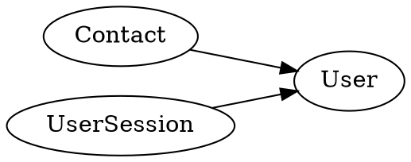

# Command: Relationships

Generate a Graphviz DOT relationship diagram of the data model, excluding
audit user joins.

**Source:** `Stricture-Generate-ModelGraph.js`

## Usage

```bash
node Stricture.js -i MeadowModel-Extended.json -c Relationships -f ./output/ -o MyDiagram
```

Add `-g` to automatically compile the DOT file to a PNG image:

```bash
node Stricture.js -i MeadowModel-Extended.json -c Relationships -f ./output/ -o MyDiagram -g
```

Add `-l` to additionally open the generated image in your OS:

```bash
node Stricture.js -i MeadowModel-Extended.json -c Relationships -f ./output/ -o MyDiagram -g -l
```

## Input

A JSON model file (basic or extended). The model index is used to resolve
join targets.

## Output

- `{OutputFileName}.dot` -- Graphviz DOT source file
- `{OutputFileName}.png` -- PNG image (only when `-g` is specified)

## Diagram Content

The generated diagram is a directed graph (`digraph`) with:

- **Layout:** Left-to-right (`rankdir=LR`)
- **Nodes:** One node per table
- **Edges:** Directed arrows from a table to the table it references via
  foreign key joins

### Filtered Joins

The `Relationships` command **excludes** edges from these audit columns:

- `CreatingIDUser`
- `UpdatingIDUser`
- `DeletingIDUser`

This produces a cleaner diagram focused on the domain model rather than
the ubiquitous audit user references. Use the `RelationshipsFull` command
to include these joins.

### Table-Level Joins

Table-level joins (declared with `=>` in MicroDDL) are also included.
A join cache prevents duplicate edges.

## Example Output



## Prerequisites

Image generation requires the `graphviz` package:

- **macOS:** `brew install graphviz`
- **Ubuntu:** `apt-get install graphviz`
- **Windows:** `choco install graphviz`

Without graphviz installed, the DOT file is still generated but the
`-g` flag will fail to produce an image.
